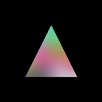

# Background
The demoscene is a familiar programming movement for those those who have been programming since the 80s. It gained popularity due to the increased proliference of low-cost home computing environments such as the Commodore 64 or the Atari ST during the 1980s. These devices were known for their advanced multimedia capabilities (much before the word was possibly invented), and had a distinct edge over the business-oriented computers from the IBM or Apple stables. Rival sceners would compete with bringing out the best capabilities of their chosen platform in dazzling displays of artistic creativity.

What started as basic plain-text credit screens in "cracked" programs, evolved into procedurally generated graphics, animations and music, all packaged into compact executables vying for smallest file size or the best performance or innovative graphical effects.

During the late 1990s and early 2000s, demosceners began to adapt Macromedia's Director and Flash applications to build cross-platform demos. This was my first exposure to the movement. Most serious exponents of the movement would be quick to dismiss this new fad. A 20 MB executable with the collective weight of the entire programming team behind Director just did not stand against a 64 KB demo written in C or hand-crafted assembly. But the ease of these environments helped inject new blood into the fold, much of it from creative types such as graphic designers and sound engineers.

The demoscene remains a more or less underground sub-culture even today.

# Procedural

Good quality graphical computing is a tough nut to crack. Not only is the domain itself technically challenging, the added effort of coming up with creative visuals is where many programmers falter. It's a field that requires both artistic as well as technical capabilities.

I spent a few years dabbling in these applications on the side, but never really picked things up seriously. But modern day programming runtimes are fast enough to allow almost anybody with some basic mathematics under their belt to whip up interesting demos. And their performance is nothing to scoff at. This repository is my collection of such effects.

All the demos in the repository are derived from the work of Ben Rutter from the House of Left.

https://github.com/benrutter/house-of-left/

https://www.instagram.com/houseofleft/

# Swatches

Swatches is a playground to iterate on visual effects created using the Shades library. It's fun to tweak parameters for visualisations and immediately see its effect on the output. Swatches offers a simple framework to define such parameters and wire them to automatically generated user interface controls.

The framework also offers the capability for rendering the effects to the user interface as well as saving the output to file. A timer-based frame rendering mechanism makes it easy to render animated effects on the UI thread without blocking.

# Shades

Shades has been originally written by Ben Rutter as a Python module. He utilises the library for creating generative 2D art. The Shades library in this repository is a C# port of the project. I have maintained API compatibility for a fairly large extent. A significant deviation from the original library is the use of SkiaSharp as the underlying graphic library in place of Pillow. Some classes are yet to be ported.

Currently Available Shades:

* BlockShade - A solid colour fill.
* LinearGradient - A graduated transition between two or more colours horizontally or vertically.
* NoiseGradient - A graduated transition based on a noise-generated pattern.
* SwirlOfShades - A composite shade that combines two or more effects into a single image.

## About Shades

Shades operates on 2D images. All Shade effects expose methods to draw shapes on an image. When a drawing method is invoked, it iterates through all pixels that are impacted by the operation and sets their colour individually. This can be slow on large images or if the effect is performing several computations before arriving at a colour or positional value.

At the core of this library is the `Shade` abstract class, which exposes methods to perform the computations required to generate a list of pixels that will be affected. The implementing concrete classes determine the colour value at the given pixel based on their own colour computation models. This step is performed by the `DetermineShade(SKPoint point)` method that the concrete classes must implement. This method receives a pixel coordinate as input and returns a colour value that is set at that position.

For example, `BlockShade` is used to generate shapes using a single solid colour. Whenever the `DetermineShade` method is called on an instance of this class, it always returns this colour without any alteration or transformation. Conversely, the `LinearGradient` effect has to determine the colour value that falls at the given coordinate based on the the position of the point between two colours.

## Usage

The following snippet shows how to draw a translucent red point on a 100 pixel wide square white background. This example uses the same syntax that is used in the Python implementation.

    var canvas = Shade.Canvas(100, 100, SKColors.White);
    var instance = new BlockShade(new SKColor(255, 0, 0, 255));
    instance.Point(canvas, new SKPoint(50, 50));

The example below shows how to draw a triangle with a gradient noise fill on a background of black.

    var canvas = Shade.Canvas(200, 200, SKColors.Black);
    var instance = new NoiseGradient(new SKColor(200, 200, 200, 200), 0, 100);
    instance.NoiseFields[0].Scale = 0.02f;
    instance.NoiseFields[1].Scale = 0.02f;
    instance.NoiseFields[2].Scale = 0.02f;
    instance.Triangle(canvas, new SKPoint(100, 50), new SKPoint(150, 150), new SKPoint(50, 150));

This port also offers an alternative syntax that makes the `SKBitmap` instance a subject of the operation, and passes the `Shade` instance as a parameter to the method. This is idiomatic C# syntax that is familiar to programmers who have used traditional .NET libraries such as GDI+.

    var canvas = Shade.Canvas(320, 200, new SKColor(0, 154, 255));
    var instance = new BlockShade(new SKColor(255, 255, 0, 255));
    canvas.Circle(instance, new SKPoint(140, 100), 60.0f);

### Saving Results

The SkiaSharp library already offers a solid API to serialize bitmaps into various file formats. The serialized data can be written to any stream object, thus making it possible to write the file to disk, to a database or over a network.

    using (var data = canvas.Encode(SKEncodedImageFormat.Png, 80))
    using (var stream = System.IO.File.OpenWrite("output.png"))
    {
        data.SaveTo(stream);
    }

# API Reference

Shades exposes two important types - `Notadesigner.Shades.Shade` and `Notadesigner.Shades.NoiseField`. Everything else is ancillary to these classes.

## Notadesigner.Shades.Shade

This is an abstract type that implements the core of the library.

### Methods

1. `SKPoint AdjustPoint(SKPoint point)`

    This method calculates the transformation of a point based on the amount of noise applied to its position. The amount of noise is computed by the `Notadesigner.Shades.NoiseField` instances stored in the `WarpNoises` property of the Shade. `WarpNoises` always contains 2 instances of this class, one for each axis. The first instance calculates the offset on the X axis and the second one calculates the offset on the Y axis.

    The noise effect is further amplified by the `WarpSize` property.

    The point is not transformed if the scale of the `NoiseField` or the `WarpSize` property of the `Shade` is 0.

2. `SKColor ApplyTransparency(SKPoint point, SKBitmap canvas, SKColor color)`

    Calculates the absolute RGB value of a point by blending the input colour with the colour that is already applied to the bitmap at the given coordinate. The formula to compute the value for each colour channel is shown below.
    
        channel = bitmap.channel + ((input.channel - bitmap.channel) * (alpha / 255))
    
    If the background is solid white (rgb(255, 255, 255)) and the input colour is solid blue (rgba(0, 0, 255, 255)), then the output colour will be rgb(0, 0, 255).
    
        red = 255 + ((0 - 255) * 1.0) = 0
        green = 255 + ((0 - 255) * 1.0) = 0
        blue = 255 + ((255 - 255) * 1.0) = 255
    
    Similarly, if the background is dark magenta (rgb(139, 0, 139)) and the input colour is chartreuse at 80% opacity (rgba(127, 255, 0, 204)), then the output will be rgb(129, 204, 27).
    
        red = 139 + ((127 - 139) * 0.8) = 129
        green = 0 + ((255 - 0) * 0.8) = 204
        blue = 139 + ((0 - 139) * 0.8) = 27

3. `SKBitmap Canvas(int width = 100, int height = 100, SKColor color = default)`

    Generates a new instance of the `SKBitmap` class. Width, height and default colour are optional parameters.

4. `Circle(SKBitmap canvas, SKPoint origin, float radius)`

    Draws a filled circle of the given radius on the bitmap. The centre of the circle is at the point specified in the origin parameter.

5. `CircleOutline(SKBitmap canvas, SKPoint origin, float radius, int weight = 1)`

    Draws the outline of a circle of the given radius on the bitmap. The centre of the circle is at the point specified in the origin parameter.

6. `SKColor DetermineShade(SKPoint point)`

    Calculates and returns the colour of a given point on the bitmap. This is an abstract method that has to be implemented by inheriting classes.

7. `void Fill(SKBitmap canvas)`

    Fills the entire bitmap with colour by iterating through it one pixel at a time. Each pixel is filled with the colour value that is returned by calling `DetermineShade` for its position.

8. `ICollection<SKPoint> GetCircleEdge(SKPoint origin, float radius)`

    Computes the pixels that make up the outer edge of a circle of the given radius. The centre of the circle is located at the point specified by the origin parameter.

9. `ICollection<SKPoint> GetShapeEdge(IList<SKPoint> points)`

    Computes the pixels that make up the outer edge of an arbitrary closed shape. The input list contains coordinates that make up vertices of the shape.

10. `void Line(SKBitmap canvas, SKPoint point1, SKPoint point2, int weight = 2)`

    Draws a line on the bitmap that connects the start and end points. The thickness of the line is determined by the value of the weight parameter.

11. `ICollection<SKPoint> PixelsBetweenTwoPoints(SKPoint point1, SKPoint point2)`

    Computes the pixels that make up the line between two points by using Bresenham's line algorithm.

12. `ICollection<SKPoint> PixelsInsideEdge(ICollection<SKPoint> edgePixels)`

    Computes the pixels that make up the inside of an arbitrary closed shape by using the ray casting algorithm.

13. `void Point(SKBitmap canvas, SKPoint point)`

    Draws a point at a given location on the bitmap.

14. `void Rectangle(SKBitmap canvas, SKPoint origin, float width, float height)`

    Draws a filled rectangle of the given width and height on the bitmap. The top left corner of the rectangle is located at the point specified by the origin.

15. `Shade(int warpSize = 0)`

    Constructor. Takes an optional value of the warp size.

16. `void Shape(SKBitmap canvas, IList<SKPoint> points)`

    Draws a filled arbitrary closed shape on the bitmap. The input list contains coordinates that make up the vertices of the shape.

17. `void ShapeOutline(SKBitmap canvas, IList<SKPoint> points, int weight = 1)`

    Draws the outline of an arbitrary closed shape on the bitmap. The input list contains coordinates that make up the vertices of the shape.

18. `void Triangle(SKBitmap canvas, SKPoint point1, SKPoint point2, SKPoint point3)`

    Draws a filled triangle on the bitmap. The three points determine the vertices of the shape.

19. `void TriangleOutline(SKBitmap canvas, SKPoint point1, SKPoint point2, SKPoint point3, int weight = 1)`

    Draws the outline of a triangle on the bitmap. The three points determine the vertices of the shape.

20. `void WeightedPoint(SKBitmap canvas, SKPoint point, int weight)`

    Draws a point on the bitmap at the given location. The size of the point is determined by weight. The output is essentially a square that originates at the specified point and extends to the left and bottom by the number of pixels specified by the weight.

### Properties

1. `NoiseField[] WarpNoises`

    An array of `Notadesigner.Shades.NoiseField` instances. Generally, this array contains 2 values for each axis. The noise is applied to each axis when the position of a point is being computed by any of the drawing methods. Inheriting classes can set more or fewer values according to their requirements.

2. `int WarpSize`

    An additional warp multiplier that is applied uniformly to both axes.
